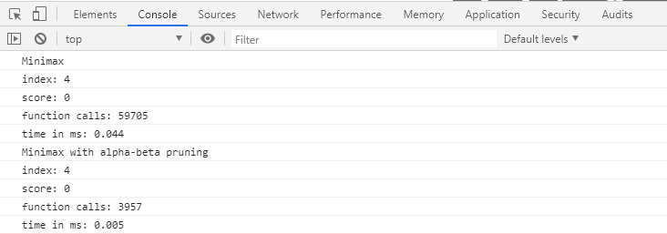

# Tic Tac Toe solved with the minimax algorithm
This repo is a simple example of tic tac toe. It ueses the minimax algorithm with alpha-beta pruning to evaluate the best index on the board. Have fun playing against it!

## About this repo

This repository contains the logic and scripts that combine
three packages:
- [Bootstrap](https://getbootstrap.com/) Build responsive, mobile-first projects on the web with the world’s most popular front-end component library.

## Gallery

Play against the AI:

Compare mnimax algorithm with and without alpha-beta pruning:

### Install

Just download this repo and execute the index.html

### Credits

Credits to [Sebastian Lague](https://www.youtube.com/user/Cercopithecan)
